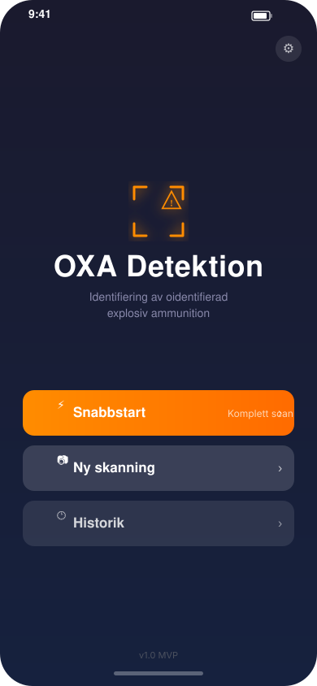
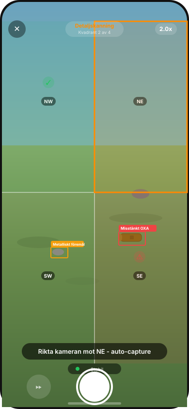
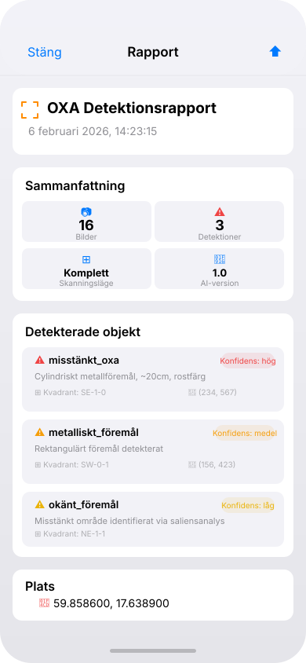
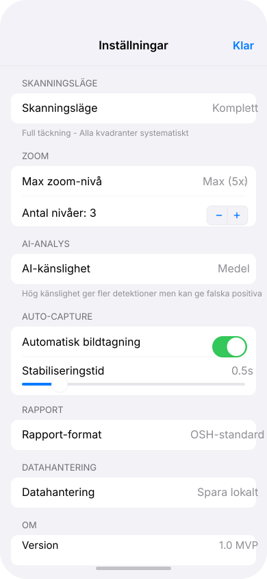
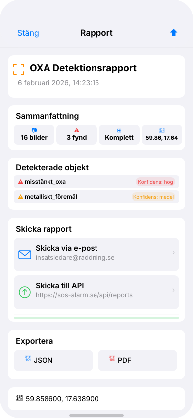

# OXA Detektion

iOS-app for räddningstjänsten att identifiera OXA (Oidentifierad eXplosiv Ammunition) i fält. Använder ett progressivt zoom-rutnät system med AI-analys för att täcka stora områden (upp till 50m räckvidd) med hög detalj.

## Preview

<table>
  <tr>
    <td align="center"><b>Startskärm</b></td>
    <td align="center"><b>Skanningsvy</b></td>
    <td align="center"><b>Rapport</b></td>
  </tr>
  <tr>
    <td></td>
    <td></td>
    <td></td>
  </tr>
</table>

<table>
  <tr>
    <td align="center"><b>Inställningar<br/>(AI + Rapportleverans)</b></td>
    <td align="center"><b>Rapport - Skicka</b></td>
  </tr>
  <tr>
    <td></td>
    <td></td>
  </tr>
</table>

## Kärnkoncept: Progressivt Zoom-Rutnät

```
Nivå 1: Översiktsbild (1x zoom) - täcker ~50m²
├── Delas upp i 4 kvadranter (NW, NE, SW, SE)
└── AI analyserar varje kvadrant

Nivå 2: Detaljbilder (2x zoom) - täcker ~12.5m² per kvadrant
├── App guidar användaren mot varje kvadrant
├── Auto-capture vid stabilitet (gyro)
└── AI analyserar och flaggar misstänkta områden

Nivå 3: Maximal zoom (5x) - täcker ~2m² per kvadrant
├── Tas på misstänkta områden från nivå 2
└── Final AI-analys för OXA-identifiering
```

## Funktioner (MVP)

- **Progressiv zoom-skanning** med 3 zoom-nivåer (1x / 2x / 5x)
- **Grid-overlay** med 4 kvadranter och visuell status (klar/misstänkt/aktiv)
- **AI-analys** via Vision framework (rektangel-detektion + saliensanalys)
- **Auto-capture** med gyro-baserad stabilitetsdetektion
- **3 skanningslägen**: Snabb (AI-styrd), Komplett, Custom
- **Konfigurerbar AI-känslighet**: Låg / Medel / Hög
- **OSH-rapport** (Objekt/Skada/Hot) i JSON + PDF
- **Lokal lagring** med sessionshistorik
- **Svenskt gränssnitt**

## Teknisk Stack

| Komponent | Framework |
|-----------|-----------|
| UI | SwiftUI |
| Kamera | AVFoundation |
| AI/Detektion | Vision + CoreML |
| Gyro/Stabilisering | CoreMotion |
| GPS | CoreLocation |
| Lagring | FileManager + UserDefaults |

## Projektstruktur

```
OXADetection/
├── App/
│   └── OXADetectionApp.swift          # @main entry point
├── Models/
│   ├── ScanModels.swift               # Enums, Quadrant, Detection
│   ├── ScanSession.swift              # Observable session state
│   ├── OSHReport.swift                # Rapport-modell
│   └── AppSettings.swift              # Inställningar med persistence
├── Services/
│   ├── CameraManager.swift            # Kamerakontroll (zoom, fokus, capture)
│   ├── AIAnalysisService.swift        # Objekt-detektion
│   ├── MotionManager.swift            # Gyro-stabilisering
│   ├── LocationManager.swift          # GPS
│   └── StorageService.swift           # Lagring + export (JSON/PDF)
├── ViewModels/
│   └── ScanViewModel.swift            # Scan-flöde orchestration
└── Views/
    ├── StartScreen.swift              # Startskärm
    ├── ScanView.swift                 # Kamera + overlay
    ├── SettingsView.swift             # Inställningar
    ├── ReportView.swift               # Rapport med export
    ├── HistoryView.swift              # Sessionshistorik
    └── Components/
        └── GridOverlayView.swift      # Grid, detektioner, pilar
```

## Bygga & Köra

1. Öppna `OXADetection.xcodeproj` i Xcode 15+
2. Välj target: iPhone (simulator eller fysisk enhet)
3. Kör med **Cmd+R**

**Krav:** iOS 17.0+, Xcode 15+

> **OBS:** Kamera, gyro och GPS fungerar bara på fysisk enhet. Simulatorn kan användas för att testa UI-flödet men behöver mock-data för full funktionalitet.

## Rapport-format (OSH)

```json
{
  "timestamp": "2026-02-06T14:23:15Z",
  "location": { "lat": 59.8586, "lng": 17.6389 },
  "overview_image": "overview_1x.jpg",
  "detections": [
    {
      "quadrant": "SE-1-0",
      "type": "misstänkt_oxa",
      "confidence": "hög",
      "description": "Cylindriskt metallföremål, ~20cm, rostfärg",
      "image": "detail_3x_SE_1_0.jpg",
      "coordinates": { "x": 234, "y": 567 }
    }
  ],
  "total_images": 16,
  "scan_mode": "komplett",
  "ai_model_version": "1.0"
}
```

## Roadmap

- [ ] Custom CoreML-modell tränad på OXA-specifika objekt
- [ ] ARKit spatial guidance
- [ ] Offline AI-modell för fältbruk
- [ ] Integration med SOS Alarm API
- [ ] Team-delning (flera enheter)
- [ ] Automatisk GPS-tagging per kvadrant

## Licens

Intern applikation för räddningstjänsten.
